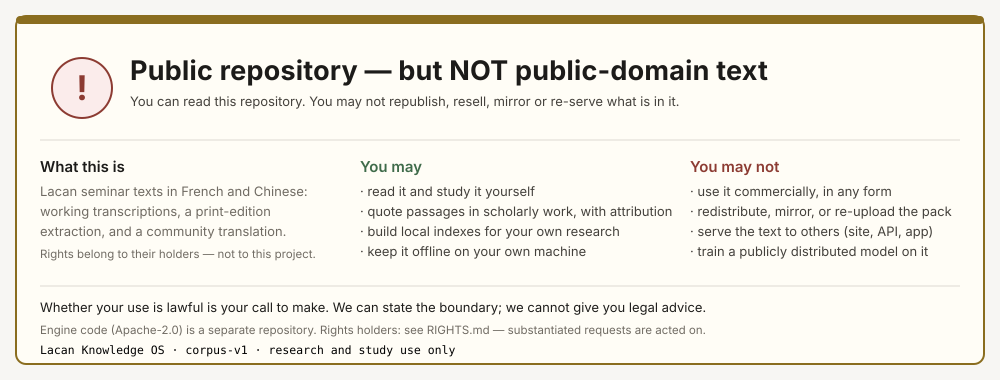
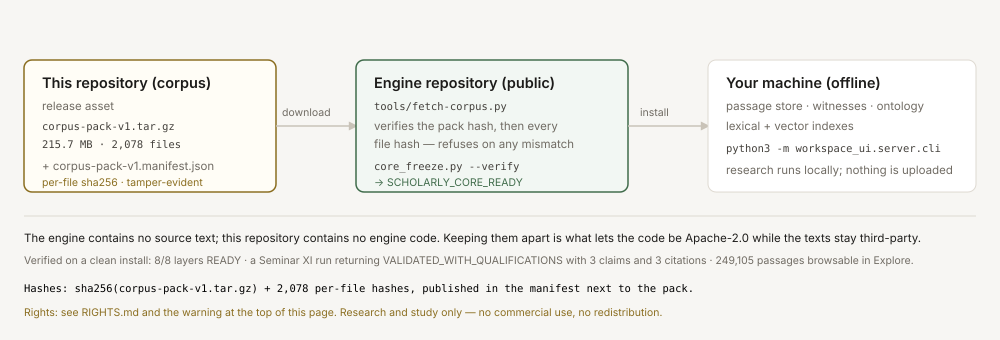

<div align="center">

# Lacan Knowledge OS — Corpus

**The corpus half of [Lacan Knowledge OS](https://github.com/YanKaFei/Lacan-Knowledge-OS).**
Lacan seminar texts, the passage store built from them, and the integrity manifest that proves
what you downloaded is what was published.

[Engine code (public, Apache-2.0)](https://github.com/YanKaFei/Lacan-Knowledge-OS) ·
[Corpus pack (release)](../../releases/tag/corpus-v1) ·
[Rights and permitted use](RIGHTS.md)



</div>

---

> ## ⚠️ This repository is public. The text inside it is **not** free to reuse.
>
> Public **visibility** is not a **licence**. This repository is published so that researchers can
> obtain the corpus the engine needs — nothing more. Every text here belongs to someone else, and
> no rights in it were transferred to this project.
>
> | | |
> |---|---|
> | ✅ **Research and study** | read, study, quote with attribution, build local indexes, keep it offline |
> | ❌ **Commercial use** | any paid product, deliverable, service or consultancy output built on this text |
> | ❌ **Redistribution** | re-uploading, mirroring, re-packaging, bundling, or posting the pack anywhere |
> | ❌ **Re-serving** | exposing the text to third parties through a website, API, app or dataset |
> | ❌ **Model training** | using it as training data for a model you distribute or deploy publicly |
>
> **Whether your use is lawful is yours to determine.** This project states the boundary because
> stating it is the honest thing to do; it gives no legal advice, and it cannot decide for you.
> Full analysis: **[`RIGHTS.md`](RIGHTS.md)**.
>
> If you hold rights in anything here and want it changed or removed, say so — see
> [Reporting a rights concern](#reporting-a-rights-concern). Substantiated requests are acted on.

---

## What this repository is



| Half | Where it lives | What it contains |
|---|---|---|
| **Engine** | [`YanKaFei/Lacan-Knowledge-OS`](https://github.com/YanKaFei/Lacan-Knowledge-OS) | the code: frozen scholarly core, MCP server, web UI, Help Centre, builders, validators, tests. Apache-2.0. **No source text.** |
| **Corpus** (here) | `YanKaFei/Lacan-Knowledge-OS-corpus` | the texts and everything derived from them: seminar files, passage store, witnesses, ontology, bibliography registry, ready-to-run indexes |

The two are deliberately separate. That separation is what allows the **code** to be Apache-2.0
while the **texts** stay third-party — and it is why the engine repository can be verified to
contain no corpus text at all.

---

## What is inside the pack

`corpus-pack-v1.tar.gz` — **2,078 files · 1,427 MB uncompressed · 215.7 MB compressed**

| Contents | Detail |
|---|---|
| `02_Lacan_Seminars/**` | 1,979 seminar files (French + Chinese) with provenance frontmatter: ids, witness, authority level, review status |
| `_data/passage_store/*.jsonl` | **249,105 passages** with `raw_text` / `normalized_text`, plus witnesses, realizations, sessions, concepts, corpus sources |
| `_data/ontology/**`, `_data/entities/**`, `_data/bibliography/**` | canonical ontology, person/case registry, bibliography registry |
| `_data/eval/**` | human-review, gold-v2 and frozen-identity artifacts — the scholarly freeze verifies these |
| `_data/corpus_inventory.json`, index manifests | the data-version inputs `core_freeze.py --verify` reads |
| `_data/index/lexical.sqlite`, `_index/passage_store.sqlite` | ready to run — no rebuild step |

Nothing private is included: no research workspace, no exports, no caches, no credentials.
The **vector index body** (`.npy`, +365 MB) is optional and not part of this pack; lexical retrieval
works out of the box, and the interface reports which retrieval mode is active.

---

## The three sources, and who holds the rights

Recorded in the corpus itself (`_data/passage_store/corpus_sources.jsonl`):

| Source | What it is | Rights position |
|---|---|---|
| `corpus-source.staferla` | a publicly readable French **working transcription** of the seminars (S1–S27) | readable online ≠ licensed for reuse. The transcription site's own legal position is not documented here, and this project does not assert one. |
| `corpus-source.seuil-print` | text extracted from the **Seuil print edition** (S1–S5), with page numbers | an in-copyright commercial edition: the publisher's and the author's estate's rights apply |
| `corpus-source.zh-translation-project` | a **community Chinese translation** project (the surviving copy) | a translation is a derivative work: the translator's rights *and* the underlying author's rights apply |

Lacan died in 1981; in France and the EU rights run for 70 years after death, so the underlying texts
remain in copyright for decades. Analyses differ by jurisdiction — in the United States the question
turns on publication date, renewal and fair use — and **nothing in this project asserts that any part
of this corpus is freely reusable anywhere**.

---

## Install it into the engine

```sh
# 1) the engine (public, Apache-2.0)
git clone https://github.com/YanKaFei/Lacan-Knowledge-OS.git
cd Lacan-Knowledge-OS

# 2) the corpus pack (this repository — public, so a plain download works)
curl -sLO https://github.com/YanKaFei/Lacan-Knowledge-OS-corpus/releases/download/corpus-v1/corpus-pack-v1.tar.gz
curl -sLO https://raw.githubusercontent.com/YanKaFei/Lacan-Knowledge-OS-corpus/main/corpus-pack-v1.manifest.json

# 3) verify and install (refuses on any hash mismatch — partial or altered downloads cannot pass)
python3 tools/fetch-corpus.py --pack corpus-pack-v1.tar.gz \
    --manifest corpus-pack-v1.manifest.json --into .

# 4) confirm the scholarly freeze, then run
python3 _scripts/_tools/core_freeze.py --verify      # → SCHOLARLY_CORE_READY
python3 -m workspace_ui.server.cli --port 3090       # → http://127.0.0.1:3090/help
```

One command if you prefer the engine to fetch it for you:

```sh
python3 tools/ensure_corpus.py --install --pack corpus-pack-v1.tar.gz \
    --manifest corpus-pack-v1.manifest.json
python3 tools/ensure_corpus.py --status              # exit 0 = ready
```

**Verified on a clean install:** 8/8 system layers `READY` · a Seminar XI research run returning
`VALIDATED_WITH_QUALIFICATIONS` with **3 claims / 3 citations** · the cited passage readable in the
Evidence Inspector (`passage.S10.unknown.P8724`) · **249,105 passages** and 62 concepts browsable in
Explore · the 13-page Help Centre.

### Integrity

| Check | How |
|---|---|
| pack hash | `sha256(corpus-pack-v1.tar.gz)` recorded as `pack.sha256` in `corpus-pack-v1.manifest.json` |
| every file | 2,078 per-file `sha256` entries in the same manifest, verified during install |
| failure mode | `fetch-corpus.py` **refuses to install** and removes any file that does not match — a truncated download or a tampered pack cannot silently corrupt the corpus |
| path safety | the extractor accepts only members under `02_Lacan_Seminars/`, `_data/`, `_index/`; absolute paths and `..` traversal are rejected |

---

## Using it responsibly

1. **Keep it on your own machine.** The engine reads the corpus locally; nothing is uploaded, and
   nothing needs to be exposed.
2. **Cite the sources, not this repository.** When you quote, attribute the transcription, edition or
   translation as recorded in `corpus_sources.jsonl` — the passage ids and witness records make that
   possible; that is what the provenance layer is for.
3. **Do not turn it into a service.** Publishing a search interface, an API or an app over this text is
   redistribution, whatever your own project's licence says.
4. **Do not hand the pack around.** If a colleague needs it, point them here — they can decide for
   themselves whether their use is lawful.
5. **Treat abstentions as information.** The engine refuses to answer when the corpus cannot support a
   question. That is not a defect to route around.

## Reporting a rights concern

If you hold rights in material published here and want it removed, clarified, attributed differently
or replaced, open an issue on the [engine repository](https://github.com/YanKaFei/Lacan-Knowledge-OS/issues)
(without pasting corpus text) or contact the maintainer through the repository profile. We will act on
a substantiated request. Removing material on request is not an admission about anything — it is the
only responsible default.

## Rebuilding or extending this pack

```sh
# in a clone of the engine, with the corpus installed
python3 tools/pack-corpus.py --out /tmp/corpus-pack             # ~215 MB
python3 tools/pack-corpus.py --out /tmp/corpus-pack --with-vector
python3 tools/fetch-corpus.py --pack … --manifest … --check     # verify without installing
```

The pack tool derives its file list from the engine's own code references, so a missing retrieval
input cannot slip through — that behaviour came from running a fresh install end to end and finding
the failures (`CORE_EXECUTION_FAILED: … alias_index.jsonl`, then freeze drift on the data-version
inputs). See [`docs/CORPUS_PACK.md`](https://github.com/YanKaFei/Lacan-Knowledge-OS/blob/main/docs/CORPUS_PACK.md).

## If you need text you can publish or sell

Use the engine with a corpus you hold rights in — the public-domain demo corpus
([`docs/DEMO_CORPUS.md`](https://github.com/YanKaFei/Lacan-Knowledge-OS/blob/main/docs/DEMO_CORPUS.md)),
your own texts, or a licensed edition. The engine is corpus-agnostic: the builders, validators,
retrieval, evidence contract and abstention discipline work identically on any corpus you supply.

---

<div align="center">

**Research and study only.** No commercial use. No redistribution. No re-serving.

Code: [Apache-2.0](https://github.com/YanKaFei/Lacan-Knowledge-OS/blob/main/LICENSE) ·
Texts: **third-party, rights reserved** · [RIGHTS.md](RIGHTS.md)

*The engine exists so that a reading can be checked against a passage number. The corpus is what makes
that possible — handle it as borrowed material, because that is what it is.*

</div>
